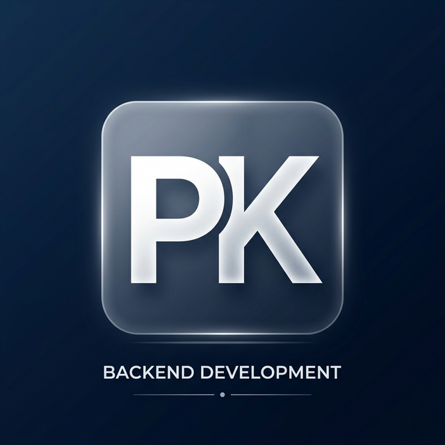

# Pavan Kalyan's Developer Portfolio 🚀

A modern, high-performance personal portfolio built to showcase my backend development skills, projects, and professional experience.



## 🛠️ Tech Stack

This portfolio is built with modern web technologies:
- **Framework:** [Next.js](https://nextjs.org/) (React)
- **Styling:** [Tailwind CSS](https://tailwindcss.com/)
- **Animations:** [Framer Motion](https://www.framer.com/motion/)
- **Icons:** [Lucide React](https://lucide.dev/)
- **Contact Form:** [Web3Forms](https://web3forms.com/) (Serverless email handling)
- **Deployment:** GitHub Pages (Static HTML Export)

## ✨ Features

- **Glassmorphic UI:** Modern frosted-glass aesthetics with cyberpunk neon accents.
- **Dynamic Animations:** Scroll progress bars, text rotation, animated timeline rays, and interactive floating particles.
- **Fully Responsive:** Optimized for both desktop and mobile viewing.
- **Functional Contact Form:** Visitors can send emails directly without needing a custom backend server.

## 🚀 Getting Started Locally

If you want to run this project on your local machine:

1. **Clone the repository:**
   ```bash
   git clone https://github.com/Pa1-kalyan/portfolio.git
   cd portfolio
   ```

2. **Install dependencies:**
   ```bash
   npm install
   ```

3. **Run the development server:**
   ```bash
   npm run dev
   ```

4. Open [http://localhost:3000](http://localhost:3000) with your browser to see the result.

## 📝 License

This project is open-source and available under the [MIT License](LICENSE).
